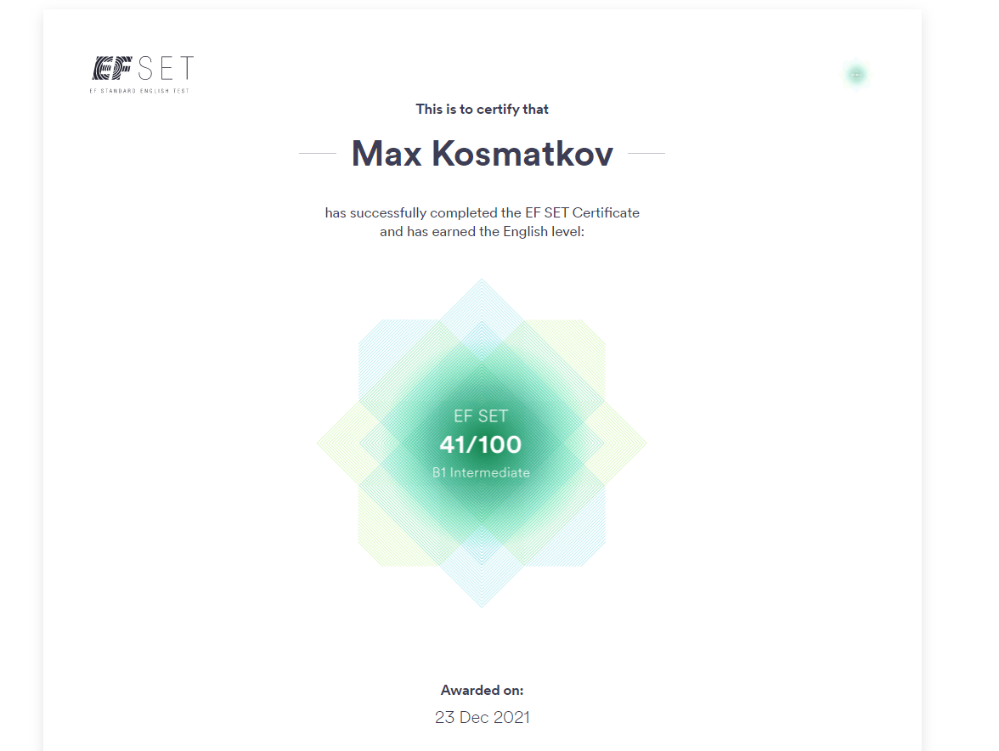

# **Max Kosmatkov**

## **Available contacts**
  * **Mobile**: _+375291289927_
  * **Email**: _freenokke@gmail.com_
  * **Discord**: _@freenokke_

## **About myself**
_The desire to learn Javascript, because I like the frontend direction. I also want to work in this field. I am purposeful, I like to learn new technologies/libraries and apply the skills I have learned, despite the fact that it is sometimes quite difficult, so one of my favorite quotes is:_
>The road surrenders to the one who walks it.

_At the moment, I haven't real commercial experience, only the development of websites / landing pages for training purposes and skills I have got after stydying on RSPreShcool course

## **Skills**
  * _HTML_
  * _CSS_
  * _JS Basics_
  * _CMS Wordpress_
  * _Bootstrap 4_
  * _BAM_
  * _SASS_
  * _Webpack (in progress)_

## **Code Example**
 _Codewars task: Array Deep Count_
```
function deepCount(a){
  if (a.length === 0) return 0;
  
  let count = a.length;
  
  let arr = a.map((item) => {
    if (Array.isArray(item)) {
      let recursion = deepCount(item);
      console.log(recursion)
      count += recursion;
    } else {
      return item
    }
  })
   
  return count
}
```

## **Course**
  * _JavaScript Development RS PreSchool 2022(done)_
  * _JavaScript Development RS PreSchool st1 2022 (in progress)_

## **Education**
 _Yanka Kupala State University of Grodno -> Civil Engineering Faculty_

## **English**
_B1_

